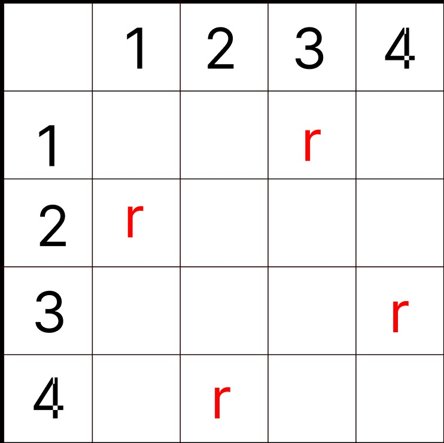
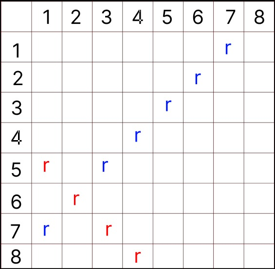

# Proiect MAP - Problema celor 8 regine - Badea Adrian

Problema reginelor presupune plasarea a 8 regine pe tabla de sah fara ca acestea sa se atace intre ele.


# Abordarea initiala a problemei

Initial reducem problema la varianta ei in care avem acces la o tabla de 4x4 si 4 regine. Pentru a aseza reginele pe tabla observ initial ca nu pot sa plasez 2 regine pe aceeasi linie si coloana, astfel, initial avem nevoie de un algoritm ce genereaza permutarile tuturor reginelor pe tabla.

# O solutie a problemei



Este bine de stiut ca nu toate permutarile sunt automat solutii deci trebuie sa vedem ce alte conditii indeplinesc reginele ce se ataca!

# Tratarea atacurilor pe diagonala



*l1, c1 reprezinta coordonatele primei regine alese*

### Reginele rosii
l1  = 5 c1 = 1 | l3 = 7 c3 = 3\
l2 = 6 c2 = 2  | l4 = 8 c4 = 4
___

l1 - l2 = c1 - c2 si l3-l4 = c3 - c4\
-1 = -1 si -1 = -1
___

### Reginele albastre

l1 = 1 c1 = 7 | l3 = 3 c3 = 5\
l2 = 2 c2 = 6 | l4 = 4 c4 = 4
___
-(l1 - l2) = c1 - c2 si -(l3-l4) = c3 - c4\
1 = 1 si 1 = 1

```

int verificare(int k){

    for(int i = 1; i<k; i++){

        if(x[k] == x[i]) return 0;
        if(k-i == abs(x[i]-x[k])) return 0;

    }

    return 1;

}

```
Deducem astfel formula finala si verificam daca diferenta liniilor este egala cu modulul diferentei coloanelor.

# Cuvant de final

Aceasta este o problema clasica de backtracking, in care se genereaza solutii pana la gasirea uneia corecte. Este un exercitiu interesant pentru ca ajuta la abordarea altor probleme din aceasta sfera precum generarea permutarilor, aranjamentelor, combinarilot samd.


